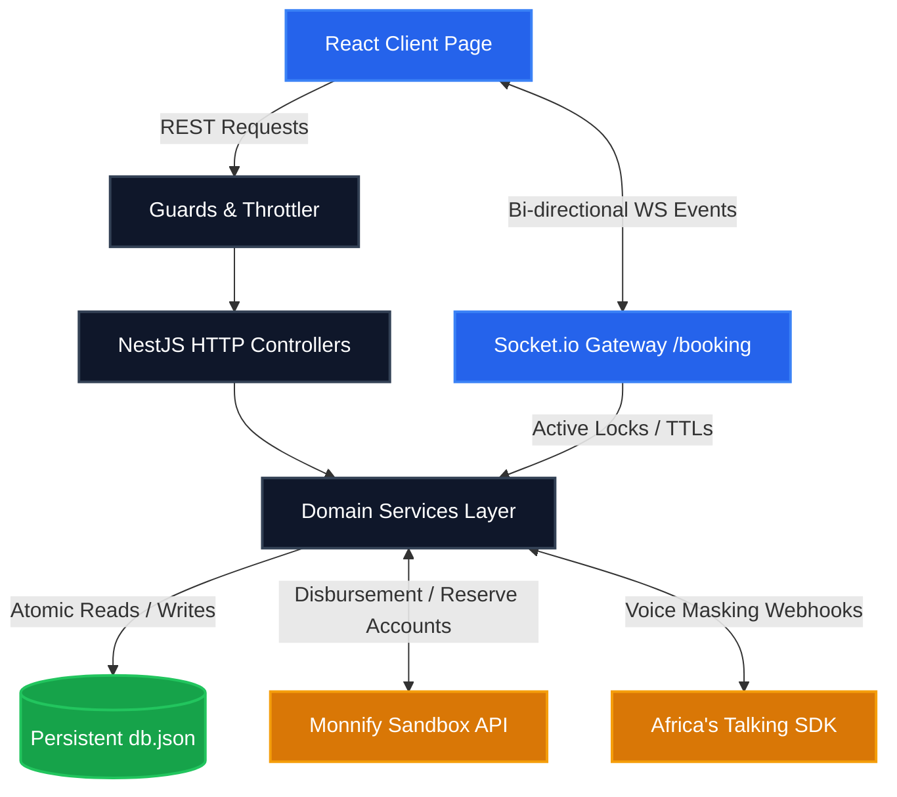
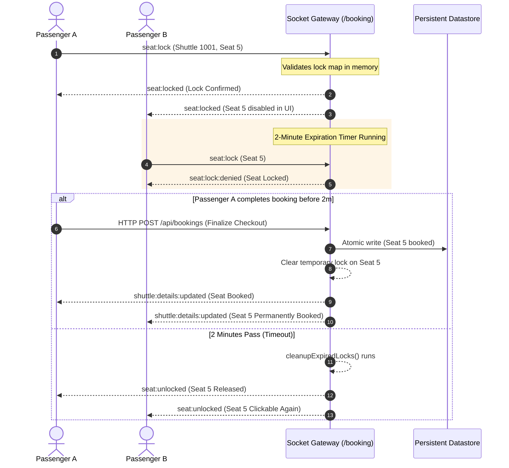
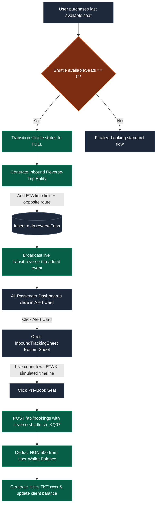

# 🐦 Raven Backend — High-Fidelity Real-Time Transit Engine

Raven is a highly modularized, production-grade, event-driven transit booking backend. Built on **NestJS** and **TypeScript**, it manages seat allocations, synchronized telemetry, secure sandbox digital wallets via **Monnify**, and private voice call bridging via **Africa's Talking**.

---

## 🗺️ System Component Architecture

The following flowchart illustrates how the client, HTTP REST APIs, the WebSocket Gateway, the persistent datastore, and third-party telecom/fintech sandboxes integrate:



---

## 🔒 1. Real-Time Seat-Lock engine (WebSocket Flow)

To prevent double-bookings, the system utilizes a high-fidelity concurrent seat-locking flow with automatic 2-minute expiration timers:



---

## 🚐 2. Automated Reverse-Trip & Pre-Booking Flow

When a shuttle gets fully booked en route, the engine dynamically triggers a reverse leg inbound trip:



---

## ⚙️ Core Modules & Decoupled Folders

```
src/
├── main.ts                     # Core startup pipeline (Validation, exception filtering, request logging)
├── app.module.ts               # Root assembly, rate limiting, cron schedules
├── db/                         # File-based DB Persistence & atomic flusher
├── health/                     # System Telemetry & health checks
├── user/                       # User profile, wallet ledger, call minute logs
├── wallet/                     # Monnify sandbox account provisioning & disbursements
├── driver/                     # Driver ratings & Africa's Talking voice callbacks
├── shuttle/                    # Route scheduling & vehicle lookups
└── booking/                    # Ticket generation, complaints, and Live WebSocket Gateway
```

---

## 📡 API Reference & WebSocket Contracts

### WebSocket Gateway Namespace: `/booking`

| Event Name | Type | Direction | Data Interface | Description |
|---|---|---|---|---|
| `room:join` | Inbound | Client $\rightarrow$ Server | `{ roomId: string }` | Enters a specific shuttle room (e.g. `shuttle_sh_1001`) |
| `room:leave` | Inbound | Client $\rightarrow$ Server | `{ roomId: string }` | Exits the shuttle room, releasing resources |
| `seat:lock` | Inbound | Client $\rightarrow$ Server | `{ shuttleId: string, seatNumber: number, userId?: string }` | Requests a seat lock for 2 minutes |
| `seat:unlock` | Inbound | Client $\rightarrow$ Server | `{ shuttleId: string, seatNumber: number, userId?: string }` | Explicitly releases a locked seat |
| `sync:initial` | Outbound | Server $\rightarrow$ Client | `{ shuttles: Shuttle[], reverseTrips: any[] }` | Initial state synchronization fired on connection |
| `seat:locks:sync`| Outbound | Server $\rightarrow$ Client | `{ shuttleId: string, locks: Record<number, Lock> }` | Syncs current active locks on room join |
| `seat:locked` | Outbound | Server $\rightarrow$ Client | `{ shuttleId: string, seatNumber: number, userId: string }` | Broadcasts that a seat is now temporarily locked |
| `seat:unlocked` | Outbound | Server $\rightarrow$ Client | `{ shuttleId: string, seatNumber: number }` | Broadcasts that a seat has been freed |
| `shuttle:details:updated` | Outbound | Server $\rightarrow$ Client | `{ shuttle: Shuttle }` | Syncs updated occupancy when a booking finishes |
| `transit:reverse-trip:added` | Outbound | Server $\rightarrow$ Client | `{ trip: ReverseTrip }` | Warns passengers that an inbound returning trip is active |

---

## 🛡️ Production Hardening Specs

1. **Strict Validation**: All controller endpoints enforce DTO checks using global class-validators.
2. **Exception Sanitization**: Stack traces are caught server-side and never leaked in HTTP payloads.
3. **Throttler Rate Limiter**: Enforces max 100 requests per 60 seconds per IP address to safeguard services.
4. **Graceful Shutdown**: Calls database flushes and cleanly terminates WS client sockets upon receiving standard SIGTERM terminations.
5. **Structured Audit Logs**: Every incoming HTTP mutation maps paths, durations, status codes, and sanitized bodies.

---

## 🚀 Quick Setup & Run

### 1. Configure Environment Variables
Copy `.env.example` to `.env` and fill in Monnify & Africa's Talking API keys:
```bash
cp .env.example .env
```

### 2. Bare-Metal Development Execution
```bash
npm install
npm run start:dev
```

### 3. Build Production Target
```bash
npm run build
npm run start:prod
```

### 4. Container Deployment (Docker Compose)
```bash
docker compose up -d --build
```
This builds a highly optimized multi-stage container and exposes port `5000` with volume persistence.

---

## ⚠️ Production Readiness Notes (Current State)

**This backend is architected with production patterns (validation, throttling, helmet, graceful shutdown, structured logging, Docker multi-stage, healthchecks) but contains demo-oriented shortcuts:**

- **Persistence**: Uses a single `data/db.json` file via custom `DbService`. Suitable only for low-concurrency demos or single-instance deployments. **For real production use a proper database** (MongoDB scaffolding already present in `app.module.ts` but commented; Mongoose + schemas recommended).
- **Authentication & Multi-tenancy**: Login/register is "sandbox permissive" (plain-text password storage, global "currentUser" context, any password accepted for known emails). There is **no per-request authenticated user**. All stateful operations act on the last-logged-in user. Real production requires:
  - Bcrypt password hashing + JWT (or Passport + sessions)
  - Request-scoped `userId` via guards + decorators (`@CurrentUser()`)
  - Proper multi-user isolation for wallets, bookings, locks, etc.
- **Seat Locking & Concurrency**: In-memory locks + JSON writes. Race conditions possible under load. Move locks to Redis or DB transactions + optimistic locking for production.
- **Integrations**: Monnify and Africa's Talking are used in sandbox mode with heavy try/catch fallbacks. Add webhook signature validation, idempotency, and live keys for prod payments.
- **Admin/Driver Auth**: Simple shared secret header guards (`RAVEN_ADMIN_KEY`). Replace with role-based JWT claims.
- **Data Seeding**: Heavy initial demo data on first run. Gate behind `NODE_ENV !== 'production'`.

**Recommended next steps for true production:**
1. Uncomment and configure MongoDB + Mongoose models.
2. Implement proper user auth (JWT + bcrypt) and attach user context to requests.
3. Replace `DbService` usage with repository pattern + Mongoose.
4. Add real payment webhook verification + audit trail.
5. Add integration / e2e tests + load testing for the seat lock WS flow.
6. Set `ALLOWED_ORIGINS` strictly + lock down CORS and API keys.

The HTTP + WS contracts, modular structure, and hardening middleware are already a solid foundation.

---

## Health & Observability

- `GET /api/health` — basic liveness (used by Docker HEALTHCHECK)
- Structured logs via custom interceptor + Nest Logger
- Graceful DB flush + WS disconnect on SIGTERM / SIGINT

Run `npm run test` or `npm run test:e2e` (expand coverage for prod confidence).
