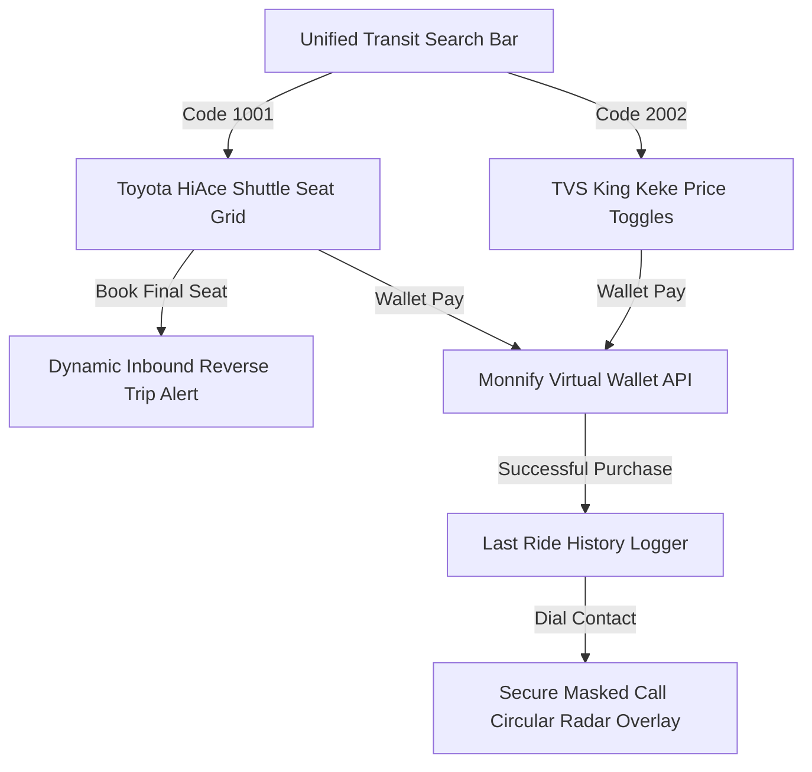

# Monnify Transit & Payment Integration

We have successfully integrated the complete, high-fidelity **Monnify Digital Wallet & Unified Transit Search** system into your full-stack NestJS/React Raven architecture.

---

## 🏗️ Full-Stack System Architecture



### 1. Unified Search Codes & Booking Flows

*   **Toyota HiAce Shuttle (Code `1001`):**
    *   **Driver:** Mustapha Yusuf (Plate: `ABJ-123-XY`).
    *   **Layout:** Premium 14-seat cabin grid selection card.
    *   **Rate:** ₦500 per seat.
    *   **Auto Alert:** If the final seat on the Toyota HiAce is reserved, an automated reverse trip inbound scheduling trigger posts an warning banner at the top of the student's dashboard: *"Shuttle 1001 is fully booked and is now INBOUND. ETA: 8 mins."*
*   **TVS King Keke (Code `2002`):**
    *   **Driver:** Ibrahim Bello (Plate: `KDS-789-QA`).
    *   **Layout:** Instantly bypasses the seat map cabin grid, presenting fare selection chips (₦200, ₦300, ₦500) and custom pricing options.

---

## 💳 Monnify Digital Wallet & Sandboxing API (`http://localhost:5000/api`)

| Route | Method | Description |
| :--- | :--- | :--- |
| `/api/wallet/create` | `POST` | Registers a reserved Monnify sandbox account (Wema Bank). |
| `/api/wallet/:userId` | `GET` | Retrieves balance, accounts, and queries real-time transactions from Monnify's servers. |
| `/api/wallet/mock-deposit` | `POST` | Simulates custom bank-transfer deposits for developer testing. |
| `/api/wallet/withdraw` | `POST` | Invokes the single-disbursement sandboxed payouts. |
| `/api/monnify/webhook` | `POST` | Live webhook notification receiver that automatically credits balances. |
| `/api/transit/reverse-trips`| `GET` | Pulls the active reverse-bound shuttle alerts to show in the UI. |
| `/api/transit/reset-seats` | `POST` | Restores the Toyota HiAce to exactly 1 vacant seat to trigger inbound alerts on the next reservation. |

---

## 📱 Premium Secure Masked Call Radar Dialing Overlay

Clicking the **Call** button on any driver card initiates a secure masked proxy call. We upgraded this overlay to feel extremely premium and modern:
1.  **Backdrop Blurring:** Uses an elegant semi-transparent navy overlay with heavy blur (`backdropFilter: 'blur(12px)'`) that covers the viewport.
2.  **Circular Dialing Radar Pulse:** Renders a gorgeous nested circular pulse ring (`pulseRing` and `pulseRing-2` standard vanilla keyframe animations) simulating radar routing connection waves.
3.  **Secure Connection Timer:** Starts with `"Initiating Secure Routing..."` and dynamically transitions to a glowing green badge `"Secure Routing Established"` after **exactly 3 seconds** of dialing, completely protecting both phone numbers.
4.  **End Action:** A sleek red dial hang-up button that instantly terminates the proxy session.

---

## 🚀 How to Run & Verify

1.  **Start your NestJS Backend:**
    ```bash
    cd raven-backend
    npm run start:dev
    ```
2.  **Start your Vite Frontend:**
    ```bash
    cd raven-frontend
    npm run dev
    ```
3.  **Sandbox Wallet Funding:**
    *   The backend pre-seeds the user `Oluwafemi Sheriff` (`usr_os1`) with **₦15,000** and **10 Call Minutes** directly, allowing you to book, pay, and dial drivers.
